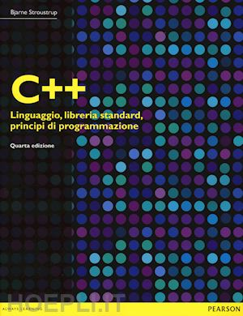

# metodologie-di-programmazione

### Materiale al corso di Metodologie di Programmazione in C++ all'Universita' di Parma
- Libro consigliato
<figure>
    
    <figcaption>C++ LINGUAGGIO, LIBRERIA STANDARD, PRINCIPI DI PROGRAMMAZIONE</figcaption>
</figure>
<a href="https://www.hoepli.it/libro/c-linguaggio-libreria-standard-principi-di-programmazione/9788865184486.html" target="_blank">Fonte</a>

