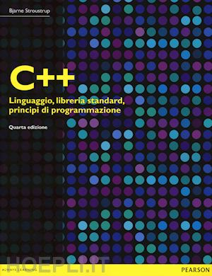

# metodologie-di-programmazione

### Materiale al corso di Metodologie di Programmazione in C++ all'Universita' di Parma
(verrà aggiunto altro materiale)
- Libro consigliato
<figure>
    
    <figcaption>  B. Stroustrup
                  C++: Linguaggio, libreria standard, principi di programmazione
                  Quarta edizione, Pearson, 2015.
    </figcaption>
</figure>
<a href="https://www.hoepli.it/libro/c-linguaggio-libreria-standard-principi-di-programmazione/9788865184486.html" target="_blank">Acquista qui</a>

#### Argomenti principali da studiare

- Capitolo 6:  Tipi e dichiarazioni
- Capitolo 7:  Puntatori, array e riferimenti
- Capitolo 8:  Strutture e enumerazioni (nota: no unioni)
- Capitolo 9:  Istruzioni
- Capitolo 10: Espressioni
- Capitolo 12: Funzioni

